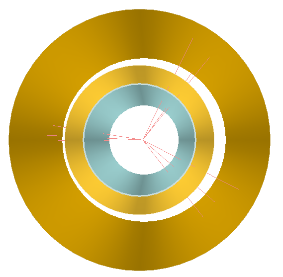

# Progetto TANS

Roberta Ferioli, Giorgio Alberto Lucia 

## Descrizione
Software per il corso di Tecniche di Analisi Numerica e Simulazione (UNITO, Fisica Nucleare e Subnucleare).
Simulazione di una collisione ad alte energie, ricostruzione del vertice primario e analisi.
Codice in linguaggio C++, in ambiente ROOT. 

## Requisiti
*   ROOT
*   mini-yaml - tutto il necessario è già aggiunto in cartella. Per maggiori informazioni sul pacchetto, si faccia riferimento a https://github.com/jimmiebergmann/mini-yaml

## Funzionalità principali
*   Generazione di particelle di numero e pseudorapidità estratti casualmente da distribuzioni personalizzabili
*   Ricostruzione del vertice primario di interazione a partire dai dati generati nella simulazione
*   Analisi della ricostruzione (risoluzione, residui, efficienza) e modello 3D per uno degli eventi
*   Possibilità di personalizzare l'esperimento tramite un file di configurazione

## Quick start
Dalla directory principale (TANS_project) aprire il terminale di ROOT e digitare:
```
root [] .x exe/loadMacros.cpp
root [] .x exe/runSoftware.cpp
```
Il software simulerà 1,000,000 eventi e svolgerà su questi la ricostruzione e l'analisi.

In alternativa, per selezionare il numero di eventi desiderato:
```
root [] .x exe/loadMacros.cpp
root [] .L exe/compileAndRunSoftware.cpp+
root [] compileAndRunSoftware(<nEvents>, <seed>);
```

È ancora possibile, infine, lanciare separatamente simulazione e ricostruzione (è poco pratico, invece, costruire il modello 3D direttamente dal terminale). Per farlo:
```
root [] .x exe/loadMacros.cpp
root [] Simulation * sim = Simulation::getInstance(<path to configuration file>);
root [] sim->runSimulation(<nEvents>);
root [] Reconstruction * rec = Reconstruction::getInstance(<path to configuration file>);
root [] rec->runReconstruction();
```

## Output generato
Il software, al termine dell'esecuzione, presenta all'utente una serie di risultati (grafici relativi alle performance della ricostruzione e rappresentazione 3D per uno degli eventi). 
Gli stessi risultati vengono anche salvati nella cartella `output` e possono essere consultati aprendo un `TBrowser`.

## Personalizzazione
La simulazione può essere personalizzata cambiando il file di configurazione. È possibile cambiare liberamente
(rispettando la sintassi richiesta da `mini-yaml`) i parametri del file di configurazione `config/configFile.txt`.

### Distribuzione uniforme per la molteplicità
È possibile utilizzare una distribuzione uniforme per la generazione della molteplicità per i singoli eventi. Per farlo, sostituire, nel file `config/configFile.txt`, il file da cui viene estratta la distribuzione (`data/kinem.root`.) con `data/kinemUnif.root`.

### Aggiungere un detector
Il software può funzionare anche con più di 3 detector (due layer di rivelatori e la beam pipe). Si noti, tuttavia, che la ricostruzione avviene interpolando con rette punti su soli due layer.
Un detector va aggiunto al file di configurazione sotto gli altri detector (o tra questi, in base al raggio) come segue:
```
    -   radius:                 3       #cm
        width:                  0.08    #cm
        lenght:                 27      #cm
        multiple_scattering:    true
        color:                  424     #kCyan-8
```
(NOTA: gli spazi sono rilevanti per la lettura tramite il parser. Per maggiori informazioni sulla sintassi, si faccia riferimento a https://github.com/jimmiebergmann/mini-yaml)
Si aggiorni, poi, il numero di layer totali.

